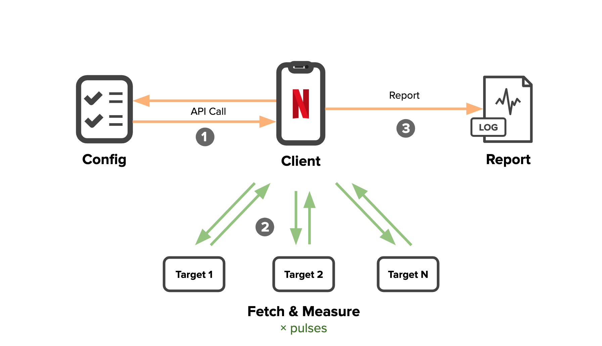

Get a taste of network with Probnik
============================

Probnik is a simple but powerful measurement framework, allowing to quickly compare various alternatives for network configuration of client-server communications. It is easy to integrate into an application code, perform tests from clients and send results for analysis upon completion.

**Note:** currently Probnik is in the Beta stage. Please use results with caution (and please submit bugs/issues) until this notice is taken down.


Components
============================


For practical applications Probnik consists of 4 main components:
* Targets - a list of choices (e.g. HTTP endpoints) that are being tested and compared.
* Recipe provider - component that provides a test recipe, listing targets to test and test parameters.
* Probe - a client agent, which performs tests against given targets and collects measurements.
* Analytics system - collects results of the test.

The repo provides the implementation for the Probe agent, plugging it into user's infrastructure to provide test recipes and ingest results.

Please see [Probnik wiki](https://github.com/Netflix/Probnik/wiki) for detailed documentation about Probnik components.

Quick Start
============================

You can install probnik with npm.

```
npm install probnik
```

Probing requires just a few lines of code in an application.

```
// function to be called with Probnik test report
function onComplete(report) {
    console.log("Probe ${report.name} report: " + JSON.stringify(report));
}

var probnik = require("probnic"),
    // recipe provider to handout test recipe to probe
    recipeProvider = new probnik.RestRecipeProvider("https://myapi.com/recipe");

// set up a browser probe
probe = new probnik.BrowserProbnik(recipeProvider, onComplete);
probe.start();
```

For more details on the setup a test recipe endpoint please refer to the [wiki guide](https://github.com/Netflix/probnik/wiki/Quick-Start).

Features and Use Cases
============================
Being a lightweight and flexible component, Probnik provides a wide range of use cases.

Today it is being used at Netflix to:
* Identify connectivity issues and faster network paths for client traffic
* Build availability metrics for your infrastructure
* Compare DNS providers
* Compare TLS ciphers and config
* Measure impact of various protocols (e.g. HTTP/1.1 vs HTTP/2)
* Build a volume/latency models of client traffic
* And more...

See more detailed coverage of these use cases in the [wiki](https://github.com/Netflix/probnik/wiki/Use-cases).

Demo 
============================
This repo includes a simple demo application, showing an example of Probnik integration and results analysis.

## Prerequisites
Make sure that `npm` (>=5.5.0) and `Node` (>=8.0.0) are installed.
Probnik and demo target ES5, so should be supported on all modern browsers.

## Installation

Install npm dependencies for the project.

```
npm install
```

## Running demo
```
npm run demo
```

Open the broser at `http://localhost:8000`. The demo also runs a webserver on `localhost:3000` to provide Probnik recipes and target endpoints.

Documentation and more info
============================
* [Wiki documentation](https://github.com/Netflix/Probnik/wiki)
* [Monitorama slides (Sergey Fedorov)](https://bit.ly/sfedorov-monitorama-pdx-19)
* TODO: Monitorama video link

Contributing
============================
Bug reports, feature requests and especially pull requests (fixing bugs or adding features) are welcome!

License
============================
Copyright 2019 Netflix, Inc.

Licensed under the Apache License, Version 2.0 (the "License"); you may not use this file except in compliance with the License. You may obtain a copy of the License at

http://www.apache.org/licenses/LICENSE-2.0

Unless required by applicable law or agreed to in writing, software distributed under the License is distributed on an "AS IS" BASIS, WITHOUT WARRANTIES OR CONDITIONS OF ANY KIND, either express or implied. See the License for the specific language governing permissions and limitations under the License.
